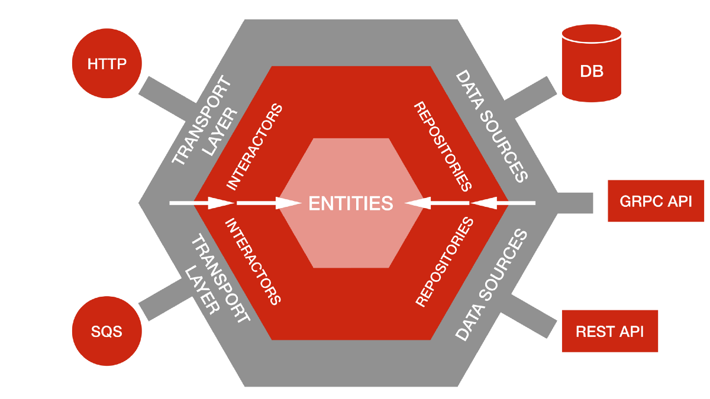

# Quatty's Application for athletes

[](https://wakatime.com/badge/github/Erickson-Eng/quatty-backend)
## Objective

Provide an API capable of registering athletes

### Dependencies list

- Backend: Mapstruct, Lombok, Spring JPA, Javax Validation and Hibernate Validation
- Infra: Mysql was used as database


## How was it designed

It was created from a hexagonal architecture where it was implemented in Java with the Spring Boot framework



## Available paths
### Available http methods/resources
* Save
* Get entity for id
* Get all
* Delete
```
https://quatty-backend.herokuapp.com/api/v1/user
```
```
https://quatty-backend.herokuapp.com/api/v1/athlete
```
```
https://quatty-backend.herokuapp.com/api/v1/address
```
